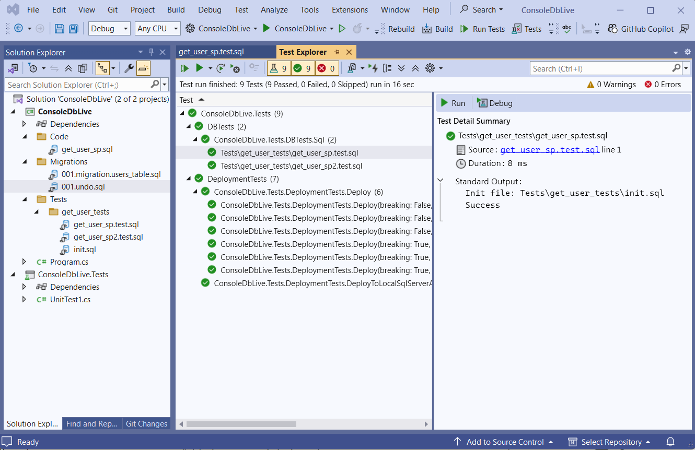

# DbLive


**DbLive** is a .NET NuGet package for **database lifecycle management**:

- Controlled schema migrations
- Separate workflow for Code deployment
- SQL-based unit tests executed as regular C# unit tests in Visual Studio
- CI/CD friendly workflow
- Staged deployment of breaking changes
- Safe rollback to a specific version

DbLive is designed for teams who treat the database as **versioned, testable, deployable code**.

---

## Features

- **Versioned database migrations**
- **Optimized code objects deploy** 
- **SQL unit tests** executed from Visual Studio as regular c# unit tests.
- **Safe CI/CD automation**
- **Breaking changes deployed in a separate phase**
- **Designed for production-grade workflows**
- **Automatic rollback to target version**

---

## Project Structure (Conceptual)
Simple project structure.
```
/Migrations
  001.migration.users_table.sql
  002.migration.orders_table.sql
  003.migration.new_indexes.sql
/Code
  get_user_sp.sql
  get_user_sp.test.sql
  delete_user_sp.sql
  delete_user_sp.test.sql
  update_order_sp.sql
  update_order_sp.test.sql
/Tests
  some_common_test.sql
  other_common_test.sql
```

**Check demo projects for more details:**
  - https://github.com/zacoders/DbLive/tree/main/src/Demo

--- 

## SQL Testing

DbLive allows writing **tests in SQL** and executing them as:

- normal C# unit tests
- inside Visual Studio
- inside CI pipelines

This enables:

- testing stored procedures
- testing views
- testing data logic
- testing migrations

> SQL becomes a first-class, testable citizen in your solution.



---

## CI/CD Friendly

DbLive is designed to be used in:

- GitHub Actions
- Azure DevOps
- TeamCity
- Jenkins
- any build system that runs `dotnet`

Typical pipeline:

1. build
2. run SQL tests in docker database container
3. run C# tests
4. deploy database
5. deploy application
6. drop old application
7. deploy breaking changes

---

## Design Goals

- Database is **not** a special snowflake - it is code
- SQL logic is **testable**
- Deployments are:
  - predictable
  - testable
  - reversible
  - automatable  
- Rollback is **not** a manual operation - it is part of the system

---

## Supported SQL Engines
 - Microsoft SQL Server
 - Azure SQL
 - PostgreSQL (Planed)
 - ?

## Installation

```powershell
dotnet add package DbLive
dotnet add package DbLive.MSSQL
dotnet add package DbLive.xunit
```