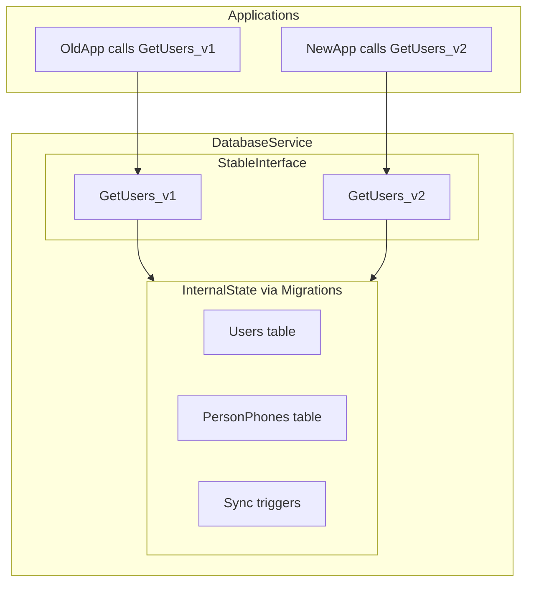
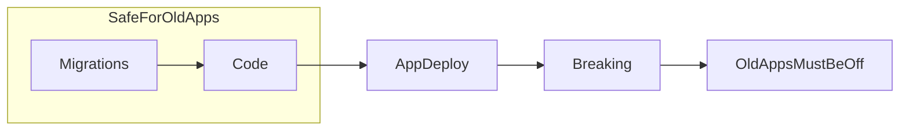
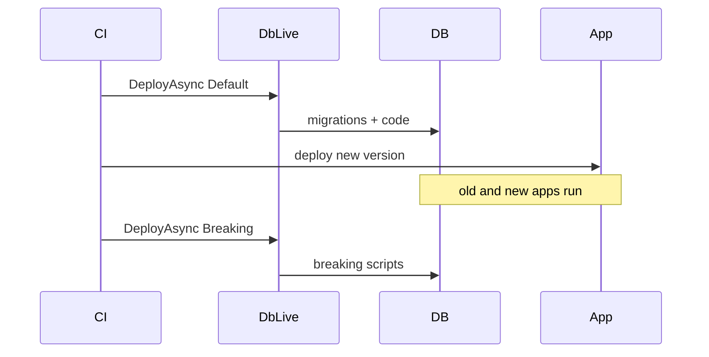

# Philosophy — Zero-Downtime Database Delivery

DbLive treats the database as an **independently deployable service** with a **versioned SQL interface** (procedures, functions, views). Internal schema evolves through backward-compatible migrations; compatibility with callers is broken only in an explicit **breaking** phase.

If you are new to DbLive, read this page before the [Quick start](../README.md#quick-start). It explains the principles the tool is built on—not just what it runs, but **why** it runs that way.

---

## The problem DbLive solves

Most migration tools focus on **running SQL scripts in order**. DbLive focuses on **keeping production running** while the database moves ahead of the application.

| Traditional migration tools | DbLive |
|----------------------------|--------|
| Schema and application change together | Schema and interface evolve **before** app cutover |
| Destructive changes block old apps immediately | Breaking changes are **deferred** to a separate phase |
| Often assumes a maintenance window | Designed for **always-on** systems |

Tools like Flyway, Liquibase, and [grate](https://github.com/grate-devs/grate) solve the **runner** problem well. DbLive adds an opinionated **compatibility lifecycle** and a **service-oriented database** model on top.

---

## Database as a service — procedures as the interface

With this approach, the database becomes **another service in your system**. It does not need to be a separate process, but it has its **own contract and deployment lifecycle**—just like a microservice.

| Layer | Role | Who owns it | Changes via |
|-------|------|-------------|-------------|
| **Interface** | Procedures, functions, views — **stable API** for applications | DB developers / DBA | Code deploy (versioned names) |
| **Internal state** | Tables, indexes, triggers, data layout | DB developers / DBA | Migrations |
| **Applications** | Consumers of the interface | App teams | Separate deploy |

### What DbLive recommends

- **Procedures are not business logic.** DbLive does not recommend a "smart database" where domain rules, workflows, or use cases live inside stored procedures.
- **Procedures are the interface** — an abstraction over the database, similar to a service API or repository boundary.
- Applications call **named, versioned** procedures. They do not depend on internal table shapes that migrations may change at any time.

### Why this enables zero-downtime

- **Migrations** can reshape internals freely (new tables, triggers, column splits) as long as the **interface contract** for existing procedure versions remains valid.
- **Behind a procedure**, almost anything can change — different joins, new tables, rewritten queries — as long as `GetUsers_v1` still satisfies old callers and `GetUsers_v2` serves new ones.
- This gives DBAs and database developers **freedom to evolve storage** without waiting for an application release, while callers keep a stable surface.

> Putting business rules, workflow orchestration, or domain logic inside procedures makes versioning and testing harder. DbLive works best when procedures **expose data access and atomic database operations**, not application use cases.



The sections below show how **interface versioning** and **internal schema evolution** work in practice.

---

## Core principles

1. **Migrations are backward-compatible** — expand schema and data; never break running applications.
2. **Code deploy is backward-compatible** — new object versions coexist with old ones in the database.
3. **Application deploy follows database readiness** — old and new applications can run in parallel.
4. **Breaking changes are explicit and last** — only after old applications are gone; removes legacy objects and columns.



DbLive enforces this order in every deploy: migrations, then code, then (optionally) breaking. See [Deployment flow](../README.md#deployment-flow) for the full step list.

---

## Why atomicity is per migration, not per deployment

DbLive does **not** wrap the entire deployment in one transaction by default. That is intentional.

- Default `TransactionWrapLevel` is **`Migration`** (see [settings.json](../src/Demo/DemoMSSQL/Scripts/settings.json)).
- Each migration is atomic: it commits or rolls back **on its own**.
- Between migrations, the system **must remain operational** — that is a feature, not a missing safeguard.
- `TransactionWrapLevel: Deployment` exists for special cases; it is not the recommended default for 24/7 systems.

Per-migration settings can override the global level (for example, `004.settings.json` in DemoMSSQL uses `"TransactionWrapLevel": "none"` for online index creation).

---

## Procedure versioning — one file, two objects in the database

Versioning applies to the **interface layer**. The repository holds one file per logical object; the database may temporarily hold multiple versions until breaking.

### Repository: single file, git is the history

File `GetUsers.sql` always contains the **current** definition. When the interface changes, you rewrite the file and bump the version in the procedure name:

```sql
-- Earlier commit: GetUsers_v1
create or alter proc dbo.GetUsers_v1
as
    select Id, UserName from dbo.Users where Deleted = 0
go
```

```sql
-- Later commit: same file, new version
create or alter proc dbo.GetUsers_v2
as
    select Id, UserName from dbo.Users where Deleted = 0 and Active = 1
go
```

Git history is your change log. You do not need separate files per version.

### Database: old and new coexist until breaking

- `GetUsers_v1` was created by an earlier code deploy. Old applications still call it.
- `GetUsers_v2` is created or updated by the current code deploy. New applications call it.
- DbLive **re-deploys** code files; it does **not** drop objects that are no longer mentioned in the file. They remain until breaking.

### Breaking: drop superseded interface versions

In `*.breaking.sql` (or during a breaking deploy):

```sql
drop proc if exists dbo.GetUsers_v1
```

See also the DemoMSSQL example: [GetUser.sql](../src/Demo/DemoMSSQL/Scripts/Code/dbo/stored-procedures/GetUser.sql) deploys `GetUser2`, while [005.breaking.sql](../src/Demo/DemoMSSQL/Scripts/Migrations/005.breaking.sql) drops the legacy `GetUser`.

---

## Schema evolution — expand/contract without breaking the interface

The same model applies when **internal state** changes while the interface stays stable. DemoMSSQL migration **007** splits phone data from `Person` into `PersonPhones`:

| Step | Artifact | What happens |
|------|----------|--------------|
| Migration | [007.migration.sql](../src/Demo/DemoMSSQL/Scripts/Migrations/007.migration.sql) | New `PersonPhones` table and sync trigger; `PhoneNumber` column on `Person` remains |
| App deploy | (your pipeline) | New application version uses updated procedures |
| Breaking | [007.breaking.sql](../src/Demo/DemoMSSQL/Scripts/Migrations/007.breaking.sql) | Drop trigger and remove legacy `PhoneNumber` column |

This follows the industry **expand / contract** pattern ([Evolutionary Database Design](https://martinfowler.com/articles/evodb.html)): expand internals first, migrate callers, contract legacy structures last.

Migration 007 changes **storage under the hood**. Applications that call versioned procedures are unaffected until breaking removes legacy columns and triggers. That is the freedom this model gives database developers: reshape internals without forcing a synchronized big-bang release.

---

## What DbLive enforces vs team responsibility

### DbLive enforces

- Deploy order: migrations → code → (optional) breaking
- Breaking only when `DeployBreaking = true` ([`DeployParameters`](../src/DbLive/DeployParameters.cs))
- Migration checksums, undo scripts, and optional [ProjectId](project-id.md) binding

### The team must ensure

- Migration and code scripts are **actually** backward-compatible
- Procedures stay **thin** — data access and atomic DB operations, not application business logic
- Applications reference the correct object version (`_v2`, not `_v1`) and avoid querying internal tables directly while those tables are in flux
- Old application instances are drained before a breaking deploy
- Breaking scripts drop every superseded object and column

DbLive provides **rails**; compatibility discipline remains a team responsibility.

---

## CI/CD mapping

A typical release pipeline separates safe deploy from breaking:



**Deploy presets:**

| Preset | Migrations | Code | Breaking | Tests |
|--------|------------|------|----------|-------|
| `DeployParameters.Default` | Yes | Yes | No | Yes |
| `DeployParameters.Breaking` | No | No | Yes | No |
| `DeployParameters.BreakingAndTests` | No | No | Yes | Yes |

Run **Default** before application deploy. Run **Breaking** only when old applications are gone.

---

## How this differs from other tools

| Tool | Focus |
|------|--------|
| **Flyway / Liquibase** | Script versioning and conventions; no first-class breaking phase or proc-interface lifecycle |
| **[grate](https://github.com/grate-devs/grate)** | RoundhousE-style runner; one-time vs any-time scripts, not compatibility phases |
| **DbLive** | Opinionated zero-downtime lifecycle for .NET + SQL; **database-as-service** with a versioned procedure interface |

---

## When DbLive is the right fit

DbLive fits well when:

- Systems run **24/7** with no maintenance window
- A database team owns **interface and internals**; application teams consume procedures as an API
- Stored procedures and functions form a **data access boundary**, not a host for domain logic
- SQL lives in source control and deploys via `dotnet` and xUnit
- Teams practice expand/contract and want those rules **encoded in the tool**

A simpler tool may suffice for greenfield projects, acceptable downtime, EF-only schema, or when the ORM owns the entire data model with no procedure boundary.

---

## Next steps

- [Quick start](../README.md#quick-start)
- [Deployment flow](../README.md#deployment-flow)
- [SQL testing](../README.md#sql-testing)
- [DemoMSSQL](../src/Demo/DemoMSSQL/) — migrations, code, breaking, and tests
- [ProjectId](project-id.md) — bind a project to a target database
